# Cellulyzer Demo

This is a representative demonstration of functionalities offered by the program <a href="./Plugin/V1.0/"><i>Cellulyzer</i></a>. The goals are 1) automated tracking and track-analyses of groups of images, and 2) interactive visualization and simulation of cellular processes.
  
These functionalities have been developed primarily as a Plugin and two Macros for the common bio-image analysis software <a href="http://imagej.net/Welcome">ImageJ</a> (<a href="http://imagej.net/Fiji">Fiji</a>). Some functionalities are also available in <a href="https://github.com/nurlicht/Asymmetric-Mitosis">Javascript</a> (to be run simply with a web-browser) and <a href="https://github.com/nurlicht/OpenCV">C++</a>.
  
For questions or comments regarding the programs, please contact <a href="mailto:jafarpour.a.j@ieee.org">jafarpour.a.j@ieee.org</a>
   

<b>Quick tour</b>
 
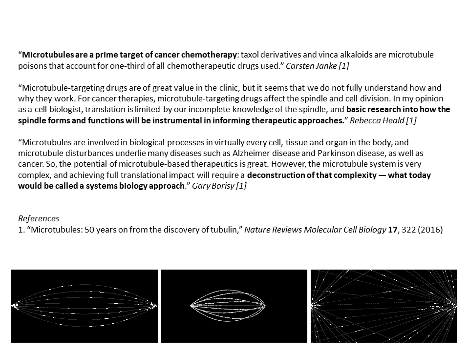
    

<b>Overview of the program</b>
 
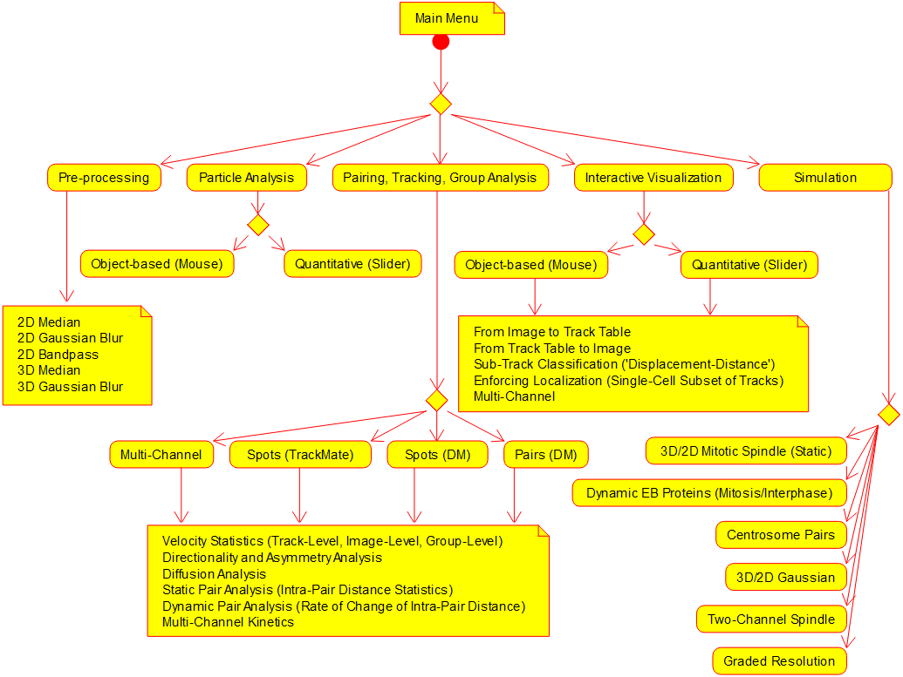

  

<b>Simulated cellular processes</b>
 
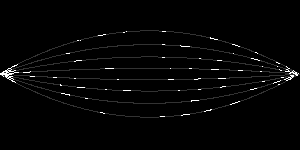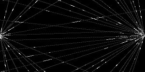
 
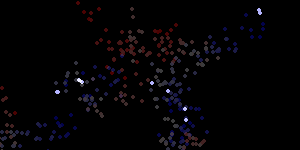

  

<b>Automated analysis (with interactive parameter adjustment)</b>
 

Multi-Channel Kinetics
 
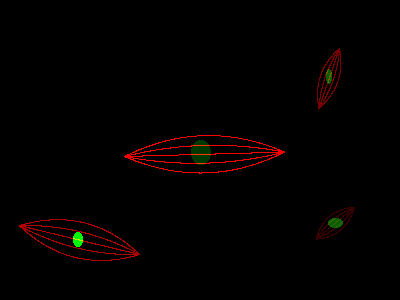
 
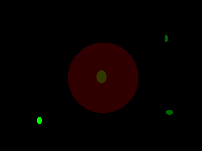
 
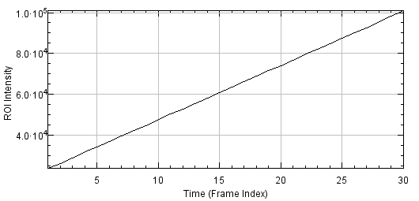
    

Simulated centrosomes: (Left) original, (Middle) paired, and (Right) tracked
 
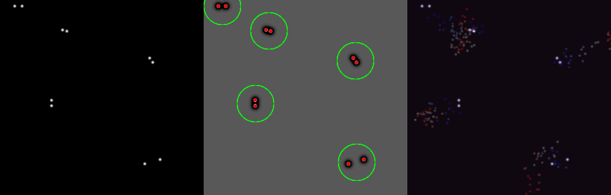

  

<b>Interactive simulations: step-by-step</b>
 

3D Spindle
 
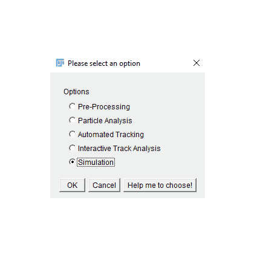
    

Centrosome Pairs
 
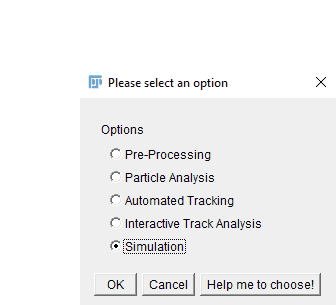
    

EB_Mitosis_Dynamics
 
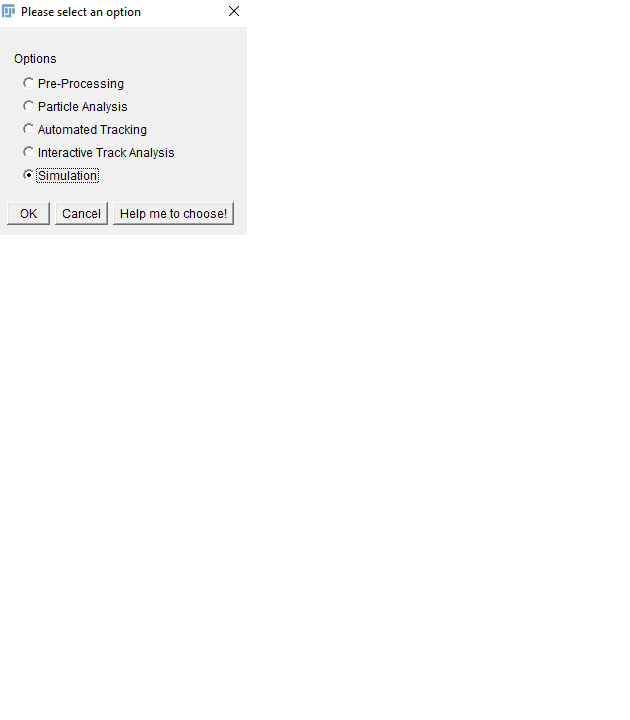
    

Realistic spot (anisotropic Gaussian intensity distribution)
 
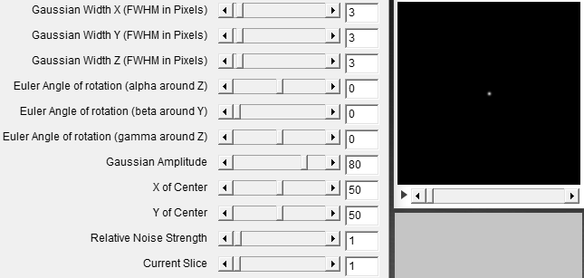
    

Deconvolution and Super-Resolution
 
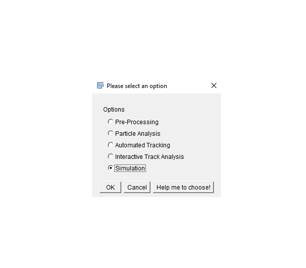
    

